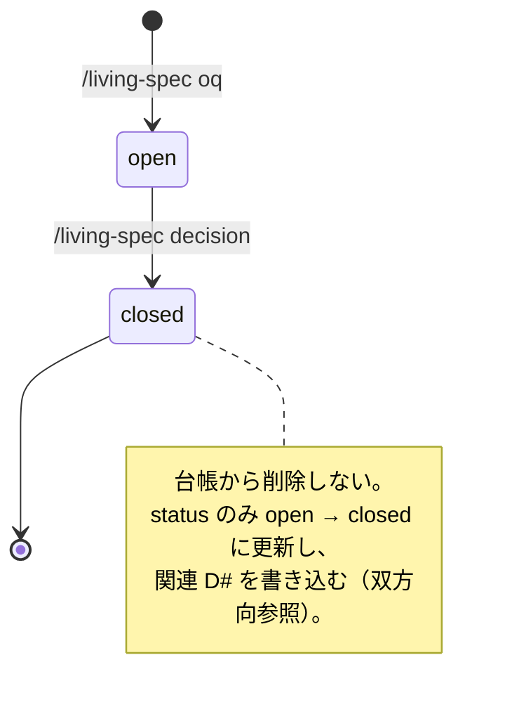

# living-spec-workflow — Issue 化前の設計収束ドキュメント運用の仕組み化

## TL;DR

Issue 化前の「設計収束ドキュメント」(living spec) を `.claude/living-specs/<slug>.md` にフラット配置し、OQ 台帳と Decision log を**両方 append-only の表**として持つ新規プラグインを作る（削除操作を設計から除いて情報の消失を断ち、参照の不整合だけを maintain の機械判定で拾う）。
コマンドは既存流儀に合わせて `/living-spec`（init / oq / decision / spec / status）と `/living-spec-maintain` の 2 本に畳む。
Notion sync は v1 スコープ外（frontmatter のフィールドだけ予約）。

## 背景 / 課題

living spec = Issue 化する前段の、未確定を抱えたまま収束させていく設計ドキュメント。Issue #87 では実運用で以下が手作業になっており、採番ミス・鮮度ズレ・相互参照切れのリスクが指摘されている。

- Decision log の append（D# を目視採番・書式維持・関連 OQ の close）
- frontmatter `last_updated` の更新漏れ
- OQ (Open Questions) 台帳 ⇔ Decision の移動（漏れ・参照切れ）
- 確度ラベル（確定 / 方向性(仮) / 未定）の収束追跡を手集計
- Notion への一方向 push（手動）

既存プラグインに living spec 専用機能はない（linear-workflow は Issue 中心で `living spec` / `Decision log` / `確度ラベル` の言及ゼロ）。

**なぜ既存の design-doc で代替できないか**: design-doc は「代替案を比較して採用案を確定し、スナップショットとして書き出す」1 回性の doc で、実装ブリッジを必須化して実装への接続を強制する設計思想を持つ。living spec は逆に「未確定を抱えたまま時間をかけて収束させる」継続運用が本質で、確定していないことこそが正常状態。同居させると design-doc の思想と正面衝突する（代替案 C 参照）。

## ゴール / 非ゴール

- **ゴール**:
  - living spec の scaffold（frontmatter + セクション構成）を機械化する
  - OQ 台帳・Decision log の採番・書式・相互参照を機械化し、手作業の採番ミスと情報の消失を消す（参照の不整合は maintain の事後検知で拾う）
  - 「仮 → 確定」の収束と open OQ 残数を機械集計して可視化する
  - 確度ラベル単位（セクション粒度）の塩漬けを検出する
  - 新規セッションで living spec の未確定から再開する導線を持つ
- **非ゴール**:
  - **Notion sync**: v1 では実装しない。Notion MCP がリポジトリに未導入で、実現手段（MCP 導入 / API token 直叩き）の選定自体が独立した設計問題のため。frontmatter の `notion_page_id` / `sync` フィールドのみ予約し、後から独立追加できる形にする
  - **ADR の代替**: adr-keeper は「プロジェクト全体に効く点の決定」をファイル群で蓄積する。living spec の Decision は「この設計収束の文脈内の判断」で 1 ファイル内セクション。粒度が違うので思想（append-only / 採番 / supersede）のみ踏襲し、実装は共有しない
  - **Issue 管理そのもの**: linear-workflow / indie-workflow の領分。living spec は確定塊を Issue 化する導線を提供するだけ
  - **実装**: feature-dev の領分。このプラグインは実装に立ち入らない
  - **doc 鮮度 lint のファイル単位判定**: doc-freshness に委譲する（後述）

## 確定した前提

grill Phase で自己解決した事項（出典つき）と、ユーザーが確定した要求。

### 調査で判明した事実

1. **`.claude/designs/` は既存**（6 doc）。同テーマの design doc はなし → 新規作成でよい
2. **adr-keeper が踏襲すべき機構を既に持つ**（出典: `adr-keeper/skills/adr/SKILL.md`）
   - `date +%Y%m%d%H%M%S` の秒精度採番（Claude に擬似時刻を作らせない規律）
   - `append_only: true` frontmatter で doc-freshness の stale 判定を免除
   - supersede 時は 4 フィールド更新（status / phase / superseded-by / last-validated）+ 相互参照の Read 検証
   - **旧 ADR を削除しない**（append-only 原則）
3. **doc-freshness の frontmatter 契約**（出典: `doc-freshness/skills/doc-freshness/references/frontmatter-spec.md`）
   - 必須: `last-validated`（YYYY-MM-DD）/ `phase`（current = 5 日 / target = 15 日 / superseded = 対象外）
   - 任意: `append_only: true` で stale 判定を免除
   - **判定粒度はファイル単位**（セクション単位の鮮度は測れない）
4. **`projects/*.md` に living spec は置けない**（出典: `linear-workflow/skills/linear-maintain/SKILL.md:63`, `:94`）
   - `projects/*.md` は linear-workflow が Linear API のミラーとして生成・管理（`source: linear` / `project_id`、テンプレは `project-doc-template.md`）
   - linear-maintain は projects/ 内の各 doc を `get_project` で**再取得・上書き更新**する（:63）
   - Linear 上でプロジェクトが Done になると **`projects/{project-name}.md` を削除**する（:94）
   - living spec は local-authoring SoT で SoT の向きが逆、かつ Decision log という append-only 履歴を抱えるため、上書きと削除の的になる
5. **Notion MCP は未導入**（リポジトリ内で `claude-meta/skills/claude-code-setup/references/mcp-servers.md` に名前があるのみ）
6. **リポジトリの流儀は「1 プラグイン = 少数コマンド + サブコマンド」**: adr-keeper はコマンド 1 個（`/adr` に list/new/supersede）、design-doc は 2 個（`/design-doc` に new/list/supersede/export、`/design-review`）
7. **linear/indie ミラー規約**（出典: `CLAUDE.md`）: 共通機能は両方に対称反映が必須。意図的な非対称は 2 つのみ
8. **深掘り系スキルには `${CLAUDE_EFFORT}` 実行時分岐が必須**（出典: `CLAUDE.md`）。maintain 系は深掘り系に該当
9. **living spec は 1 ファイル内セクション構成**（Issue #87 が明言。adr-keeper との粒度違いの根拠として使われている）
10. **living spec の実ファイルは存在しない**（`.claude/linear/` `.claude/indie/` ともこのリポジトリには未作成）= グリーンフィールド設計

### ユーザーが確定した要求（grill）

| # | 論点 | 決定 |
|---|------|------|
| 1 | 既存 `projects/*.md` との関係 | **専用ディレクトリに分離**（前提 4 の上書き・削除リスクを回避） |
| 2 | 配置ルート | **`.claude/living-specs/` フラット**（adr-keeper / design-doc と同流儀。linear/indie 未導入でも単体で動く＝プラグイン間依存禁止に整合） |
| 3 | OQ の close 時の扱い | **台帳から消さない**。`status: closed` で残し、Decision とは双方向参照で紐づける |
| 4 | Notion sync | **v1 スコープ外**。frontmatter のみ予約 |
| 5 | 確度ラベルの stale 検出 | **ラベルに `since` 日付を併記して独自判定**。ファイル鮮度は doc-freshness に委譲したまま |

## 採用案

### 全体像

```
.claude/living-specs/<slug>.md        # living spec 本体（1 プロジェクト = 1 ファイル）

living-spec-workflow/
├── .claude-plugin/plugin.json
├── commands/
│   ├── living-spec.md                # init / oq / decision / spec / status
│   └── living-spec-maintain.md       # 整合 + 鮮度
├── skills/
│   ├── living-spec/                  # CRUD 系（effort: medium 固定）
│   │   ├── SKILL.md
│   │   └── references/
│   │       ├── template.md           # scaffold テンプレ（プレースホルダ方式）
│   │       └── format-spec.md        # 表スキーマ・確度ラベル・採番規約の正本
│   └── living-spec-maintain/         # 深掘り系（${CLAUDE_EFFORT} 分岐あり）
│       ├── SKILL.md
│       └── references/
│           └── check-rules.md        # 検証ルールと severity
├── CHANGELOG.md
└── README.md
```

### living spec のファイル構造

```markdown
---
phase: target                  # doc-freshness 契約（収束中 = target）
last-validated: 2026-07-15     # doc-freshness 契約。人が内容を確認した日
last_updated: 2026-07-15       # 機械更新。init / oq / decision / spec が書き込みのたびに更新
notion_page_id: null           # v1 未使用（予約）
sync: null                     # v1 未使用（予約）
---

# <プロジェクト名>

## 現在地サマリ
<!-- 3 行以内。いま何が確定していて次に何を決めるのか -->

## 仕様

| 項目 | 内容 | 確度 | since |
|------|------|------|-------|
| 認証方式 | OAuth 2.0 | 確定 | 2026-07-15 |
| セッション保持 | Redis | 方向性(仮) | 2026-07-10 |
| 権限モデル | - | 未定 | 2026-07-08 |

## Open Questions

| OQ# | 問い | status | 関連 D# | since |
|-----|------|--------|---------|-------|
| OQ1 | セッションストアに Redis を使うか | open | - | 2026-07-10 |
| OQ2 | 認証は OAuth か独自か | closed | D1 | 2026-07-15 |

## Decision log
<!-- append-only。既存エントリの編集禁止 -->

### D1: 認証方式は OAuth 2.0 を採用
- 日付: 2026-07-15
- 確信度: 高
- 根拠: <!-- なぜこう決めたか -->
- 出典: <!-- ファイルパス / URL / 会話 -->
- 残: <!-- この決定で残った未確定 -->
- 関連 OQ: OQ2

## 進め方フェーズ
## タイムライン
## 参照ソース
```

**living spec は committed 前提**（プロジェクトローカルに永続化）。Decision log を履歴として残す設計なので、gitignore しない。adr-keeper が「ADR は committed 前提」を明記しているのと同じ規律（`adr-keeper/skills/adr/SKILL.md:39`）。

**Shared State 契約フィールドは持たない**。CLAUDE.md の Shared State 規約は「**複数プラグインが読み書きする** shared state ファイル」が対象で、type も `session | follow-up | knowledge | event-cache` の 4 値に限られる。living spec は v1 では他プラグインの読み手を持たない（Issue 化導線は疎結合、逆方向連携は未解決事項 4 で v1 非実装）ため、`shared_state_type` / `producer` / `consumers` / `schema_version` を名乗る根拠がない。同じ local-authoring な doc である design-doc・adr-keeper も契約フィールドを持たない。逆方向連携（未解決事項 4）が確定して実際に consumer が生まれた時点で、規約の type 一覧への `living-spec` 追加とあわせて導入する。

**`source: local` も持たない**。Linear ミラー（`source: linear`）との区別が目的だったが、`.claude/living-specs/` へのフラット配置で物理的に分離済みなので、区別する対象が同居しない。

**日付フィールドの更新主体**:

| フィールド | 更新主体 | タイミング |
|---|---|---|
| `last_updated` | **機械**（init / oq / decision / spec が `date +%Y-%m-%d` で書く） | ファイルに書き込むたび |
| `last-validated` | **人**（`/living-spec-maintain` の実行＝内容を確認する行為とみなす） | maintain を回したとき |

`last-validated` を機械更新しないのは doc-freshness の規定（`frontmatter-spec.md:16` 手動更新 / `:67` 自動更新はアンチパターン）に従うため。maintain の実行を「レビュー行為」と定義することで、`phase: target` の 15 日 stale は「15 日間 maintain を回していない＝実際に点検されていない」を正しく意味する。

**表形式を選ぶ理由**: 仕様・OQ を Markdown 表にすると、確度集計と OQ 残数カウントが**機械パースで完結**する。CLAUDE.md のコスト×精度パイプライン指針の原則 #1（ファネル: 安価な機械判定を先頭に置く）と #8（外部オラクル: LLM に投げる前に機械判定で落とす）に沿う。bdd-spec が同値分割表を機械判定の第 1 段に置いているのと同型（`bdd-spec/skills/evaluate-spec/SKILL.md:177`）。パース手段は専用スクリプトを起こさず、skill 内の Grep / Bash で行う（doc-freshness・bdd-spec と同方式）。

### データモデル: 二重 append-only

**核心は「情報を move しない」こと。** ただし効き目の範囲を正確に切り分ける。Issue #87 が挙げた失敗モードのうち:

- **情報の消失**（close した OQ が台帳から消える / 移動の途中で失敗して片方にしか無い）→ move という操作を設計しないことで**構造的に消える**。削除を含む操作が存在しないため、Edit がどう部分適用されても行は残る
- **参照の片側漏れ**（OQ に `関連 D#` が入っていない / Decision に `関連 OQ` が無い）→ **構造的には防げない**。表を書くのは Edit を叩く LLM で、書き漏らしは起こりうる。これは maintain 段 3（Critical）と段 5（Warning）の事後検知で担保する

つまり「move をやめる」が消すのは消失であって、不整合ではない。不整合の検知器（段 3）を Critical で持つのはそのため。



| 要素 | 操作 | 不可逆性 |
|------|------|----------|
| OQ 台帳 | append（新規 OQ）+ `status` / `関連 D#` の in-place 更新のみ | 行の削除禁止 |
| Decision log | append のみ | 既存エントリの編集・削除禁止 |
| 仕様表 | 確度ラベルと `since` の in-place 更新 | 行の削除は許容（項目自体の撤回） |

**OQ の reopen は許容しない**。close 後に議論が再燃した場合は**新しい OQ を起票**し、旧 OQ / 関連 D# を参照する。adr-keeper が「決定を書き換えず、新 ADR で supersede する」のと同じ思想で、決定の履歴を線形に保つ。

**確度ラベルの逆行（確定 → 方向性(仮)）は許容する**。決定が覆るのは正常な事象なので、`since` を更新するだけで警告は出さない（過剰検知の抑制）。ただし対応する Decision が既にある場合は、新しい Decision を append して覆った経緯を残すことを maintain が促す。

### コマンド構成

| コマンド / サブコマンド | 動作 |
|---|---|
| `/living-spec init <slug>` | `.claude/living-specs/<slug>.md` を scaffold。既存なら中止 |
| `/living-spec oq <text>` | OQ 台帳に append。`OQ<max+1>` を機械採番、`status: open`、`since` に `date +%Y-%m-%d` |
| `/living-spec oq list` | **既定は open のみ**表示（Issue #87 の運用感を表示フィルタで再現）。`--all` で closed 込み |
| `/living-spec decision <text>` | Decision log に append。`D<max+1>` を機械採番。関連 OQ を AskUserQuestion で選ばせ、選ばれた OQ を `closed` + `関連 D#` に更新し、Decision 側にも `関連 OQ` を書く（**双方向参照を 1 操作で成立させる**） |
| `/living-spec spec <項目> <確度>` | 仕様表の確度ラベルを更新し、`since` を `date +%Y-%m-%d` で機械付与する。新規項目なら行を append |
| `/living-spec status` | 進捗ビュー: 確度ラベル集計（収束率 = 確定 ÷ 全項目）+ open OQ 残数 + セッション再開導線（open OQ と未定項目を提示） |
| `/living-spec-maintain` | 整合 + 鮮度チェック（下記） |

`spec` サブコマンドを置くのは、**`since` の発生源を機械に寄せる**ため。OQ の `since` は `oq` が機械付与するのに仕様表だけ手編集に委ねると、「確度だけ変えて `since` を据え置く」（実際は動いているのに stale 警告＝偽陽性）と「`since` だけ触る」（塩漬けなのに沈黙＝偽陰性）が両方起こり、段 6 の塩漬け検出が人手依存で劣化する。

`decision` は append と in-place 更新の複数編集になる（Edit は部分置換なので 1 回の書き込みにはならない）。ただし**どの編集も削除を含まない**ため、部分適用で OQ や Decision が消えることはない。片側参照だけが残った状態は maintain 段 3 が Critical で検出する。

### maintain の検証ルール（ファネル構成）

安価な機械判定を先頭に置き、意味判断を後段に回す。

| 段 | 判定 | 手段 | severity |
|---|---|---|---|
| 1 | 表スキーマ違反（列欠落・確度ラベルが 3 値外・`since` が日付でない） | 機械パース | Critical |
| 2 | 採番の連続性（D# / OQ# の重複・欠番） | 機械パース | Critical |
| 3 | 相互参照の整合（OQ の `関連 D#` ↔ Decision の `関連 OQ` の双方向一致） | 機械パース | Critical |
| 4 | 「参照ソース」セクションの**外部 URL** の死リンク（内部相対リンクは doc-freshness Phase 5 に委譲） | 機械判定 | Warning |
| 5 | `closed` な OQ に `関連 D#` が無い / `open` な OQ に `関連 D#` がある | 機械パース | Warning |
| 6 | 確度ラベル stale（`方向性(仮)` / `未定` のまま N 日経過） | `since` と `date` の差分 | Warning |
| 7 | frontmatter の `last_updated` 更新提案（`last-validated` は doc-freshness Phase 8 に委譲） | 機械判定 | Info |
| 8 | 現在地サマリが実態とずれていないか | LLM 判断（段 1-7 を通過後） | Info |

`${CLAUDE_EFFORT}` 分岐: `low` / `medium` は段 1-7 の機械判定のみ。`high` 以上で段 8 の LLM 判断を追加する。

**段 6 の N は焼き込まない**。`.claude/doc-freshness.json` があれば `thresholds.target` を読み、無ければ 15 にフォールバックする。doc-freshness の閾値はプロジェクト側で上書きできる（`thresholds.md` が `"target": 30` / `60` を例示）ため、15 を固定すると上書きしたプロジェクトで即座に二重基準になる。フォールバックを持つことで doc-freshness 未導入でも動く（プラグイン独立を維持）。

### doc-freshness との住み分け

| 責務 | 担当 |
|------|------|
| ファイル単位の鮮度（`last-validated` / `phase` stale）の**検出** | **doc-freshness**（`.claude/living-specs/` を走査対象に追加） |
| `last-validated` の**更新**（点検を通過したときに人の承認つきで） | **living-spec-maintain** の完了処理（doc-freshness Phase 8 は「stale な doc を一括で今日にする」汎用オプションで、maintain を回さなくても更新できてしまう。それに委ねると「maintain の実行＝点検した」の意味論が成立しない） |
| frontmatter スキーマ検証 | **doc-freshness** |
| 内部相対リンクの実在検証（Phase 5） | **doc-freshness** |
| セクション単位の鮮度（確度ラベルの `since` stale） | **living-spec-maintain**（doc-freshness では測れない粒度） |
| 表スキーマ・採番・相互参照・外部 URL の死リンク | **living-spec-maintain** |

**doc-freshness 未導入時は fail-fast させず、鮮度検出が縮退する前提で動く**。living spec の中核価値（OQ・Decision・収束の可視化）は maintain 単体で成立し、失われるのはファイル単位の stale 検出だけなので、feature-dev Phase 6 のような fail-fast（品質ゲートが skip されると検証そのものが無意味になるケース）とは重みが違う。ただし縮退していることは `/living-spec-maintain` の実行時に 1 行 warning で明示する（silent に不成立にしない）。

`append_only: true` は**付けない**。living spec は `phase: target` で収束させていく生きた文書で、鮮度を測る対象そのものだから（ADR とは逆）。design doc が付けないのと同じ理由。

### Issue 化の導線（linear/indie と疎結合）

living spec 側からプラグインを呼ばない。`/living-spec status` が「確定した塊」を提示し、ユーザーが `/issue-create`（linear）/ `/indie-issue-create`（indie）に手で渡す。逆に issue-create 側から living spec を読ませる連携は v1 では作らない（未解決事項に記載）。

### 採用したパイプライン設計原則（CLAUDE.md 規約）

- **採用**: #1 ファネル（maintain の段 1-7 機械判定 → 段 8 LLM）、#8 外部オラクル + fail-closed（表パースで落とす。パース不能なら Critical に倒す）、#3 段階予算（maintain の `${CLAUDE_EFFORT}` 分岐）
- **不採用**: #4 モデルルーティング / #7 敵対的独立検証 / #5 暴走ガード（agent fan-out がなく単一コンテキストで完結するため）、#2 2 軸スコア化（maintain の findings は機械判定が主体で confidence が常に 100。severity のみで足りる）

## 検討した代替案

### プラグイン構成

| 観点 | 案 A: issue 準拠（6 コマンド分割） | **案 B: 1 コマンド + サブコマンド（採用）** | 案 C: design-doc を拡張 |
|------|------|------|------|
| 構成 | init / decision / oq / maintain / sync / session-start を独立コマンド化 | `/living-spec`（init·oq·decision·spec·status）+ `/living-spec-maintain` | design-doc に living spec モードを追加 |
| 既存流儀との整合 | × 乖離（既存は最大 2 コマンド） | ○ adr-keeper / design-doc と同型 | △ design-doc の責務が 2 つに割れる |
| 責務の明確さ | △ oq と decision の境界が曖昧 | ○ CRUD 系 / 深掘り系で skill 分離 | × 確定スナップショットと継続収束が同居 |
| 変更量 | 大 | 中 | 中（SKILL.md 255 行が更に肥大） |
| `${CLAUDE_EFFORT}` 規約 | 分岐先が不明瞭 | ○ maintain だけ深掘り系として分離 | △ 既存 design-doc は medium 固定 |
| 学習コスト | 6 個 | 2 個 | 0 |

- **案 A を採らない理由**: コマンド乱立で既存流儀から外れ、component-addition-advisor の退路確保（既存拡張で解けないかを先に検証する）に抵触する。
- **案 C を採らない理由**: design-doc の「実装ブリッジ必須・1 回性スナップショット」という設計思想と、living spec の「未確定を抱えた継続収束」が正面衝突する。

### living spec の配置

| 観点 | **採用: `.claude/living-specs/` フラット** | 案: `projects/` に共存 | 案: `.claude/{linear\|indie}/{slug}/living-specs/` |
|------|------|------|------|
| 上書き・削除リスク | ○ なし | × linear-maintain が上書き（:63）・Done 時削除（:94） | ○ なし |
| プラグイン独立性 | ○ linear/indie 未導入でも動く | × linear-workflow に除外規約の追加が必要 | × linear/indie のディレクトリ規約に依存 |
| 既存流儀 | ○ `.claude/adr` / `.claude/designs` と同型 | △ | △ |

- **`projects/` 共存を採らない理由**: SoT の向きが逆（local-authoring vs Linear ミラー）で、linear-workflow 側に「`source: local` は触らない」除外規約を足す必要があり、プラグイン間依存禁止に反する。
- **slug-scoped を採らない理由**: 新規プラグインが linear/indie のディレクトリ規約に暗黙依存し、両方未導入だと置き場所が決まらない。

### OQ の close 時の扱い

| 観点 | **採用: 消さず `status: closed`** | 案: 台帳から消して Decision へ移す | 案: 消すが Decision に全文転記 |
|------|------|------|------|
| 情報の消失 | ○ 構造的に起きない（削除操作が無い） | × move 途中の失敗で OQ が消える | △ 転記が成功すれば残る |
| 参照の片側漏れ | △ 起こりうる（段 3 が Critical で検知） | △ 同左 + 消失と区別できない | △ 同左 |
| ファイル肥大 | △ closed が蓄積 | ○ open のみ | △ |
| adr-keeper 思想との一貫性 | ○ append-only | × | × |
| 表示の運用感 | ○ フィルタで open のみ表示 | ○ | ○ |

- **移動案を採らない理由**: Issue #87 がリスクとして挙げた「移動漏れ・参照切れ」のうち、**消失**のほうは move をやめれば構造的に消える。**不整合**のほうはどの案でも事後検知が要るが、移動案では「消えたのか、まだ書いていないのか」を検知器が区別できない（削除が正常操作なので）。採用案は消失を設計から除くことで、検知器が扱う失敗モードを 1 つに絞れる。
- **全文転記を採らない理由**: 同一テキストが 2 箇所に存在し drift する。

## 設計判断ログ

- [→ADR候補] **local-authoring な shared state は `.claude/<domain>/` にフラット配置し、workflow プラグインの slug-scoped 構造に相乗りしない** — linear/indie 未導入でも動く独立性を保つため。adr-keeper / design-doc / living-spec-workflow に共通する配置方針で、今後の新規 doc 系プラグインにも効く
- [→ADR候補] **append-only な台帳では「情報の move」を設計しない。status 更新 + 双方向参照で表現する** — 移動漏れ・参照切れという失敗モードを事後検知でなく構造で消す方針。adr-keeper の supersede（旧を消さず status 更新）と同じ原理
- [local] living spec の仕様表・OQ 台帳を Markdown 表にする — 確度集計と OQ 残数を機械パースで完結させ、LLM 判断の前段に機械判定を置くため
- [local] OQ の reopen を許容せず、再燃時は新規 OQ を起票する — 決定の履歴を線形に保つ
- [local] 確度ラベルの逆行（確定 → 仮）は警告しない — 決定が覆るのは正常事象。過剰検知の抑制
- [local] `append_only: true` を living spec に付けない — `phase: target` で鮮度を測る生きた文書のため（ADR とは逆）
- [local] 確度ラベルの stale 閾値を焼き込まず `.claude/doc-freshness.json` の `thresholds.target` を読む（fallback 15）— doc-freshness の閾値はプロジェクト側で上書き可能なので、15 を固定すると上書き環境で二重基準になる。fallback を持つことで doc-freshness 未導入でも動く
- [local] Notion sync を v1 スコープ外にする — MCP 未導入で実現手段の選定が独立した設計問題のため
- [local] Shared State 契約フィールドを v1 では持たない — 規約の対象は cross-plugin なファイルで、v1 の living spec に consumer が存在しない。design-doc / adr-keeper も持たない前例に倣う。consumer が生まれた時点で type 一覧への追加とセットで導入する
- [local] `last-validated` の更新主体を「`/living-spec-maintain` の実行＝レビュー行為」と定義する — doc-freshness が手動更新を要求し自動更新をアンチパターン化しているため機械化できない。maintain を更新点に定めることで、15 日 stale が「点検されていない」を正しく意味するようになる
- [local] 仕様表の確度更新に `spec` サブコマンドを置く — `since` の発生源を機械に寄せないと段 6 の塩漬け検出が人手依存で劣化する（偽陽性・偽陰性が両方出る）
- [local] doc-freshness 未導入時は fail-fast させず縮退 warning に留める — 失われるのはファイル単位の stale 検出のみで、living spec の中核価値は maintain 単体で成立するため。feature-dev Phase 6（品質ゲートが skip されると検証自体が無意味）とは重みが違う
- [local] maintain の機械判定に専用スクリプトを起こさず skill 内の Grep / Bash で行う — bdd-spec・doc-freshness と同方式。design doc の抽象度では実装手段まで縛らない

## 未解決事項 (open)

### 1. Notion sync の実現手段

- (a) Notion MCP を `_requirements` に入れて dormant 判定 — pros: 認証を MCP に委譲できる / cons: MCP 導入が前提条件になる
- (b) Notion API token + curl — pros: MCP 不要 / cons: 認証情報の保持と外部送信の確認フローを自前設計
- **現時点の方向性**: (a) 有力。外部送信の確認フローを自前で持つより MCP に委譲するほうが安全側
- **確定タイミング**: v1 リリース後、実運用で push が必要になった時点

### 2. 進捗ビューの収束率の算出式

- (a) 確定 ÷ 全項目 — pros: 単純 / cons: 項目数が増えると率が下がって見える
- (b) 重み付き（確定 1.0 / 方向性(仮) 0.5 / 未定 0） — pros: 収束の途中経過が見える / cons: 恣意的
- **現時点の方向性**: (a) で始める。実運用で「率が動かなくて役に立たない」と分かったら (b) に変更
- **確定タイミング**: v1 実装時に (a) 固定、1 プロジェクト運用後に再評価

### 3. OQ 台帳が肥大したときの分割

closed が蓄積して 1 ファイルが読みにくくなる可能性がある（採用案のトレードオフ）。

- (a) closed を `<slug>-archive.md` に切り出す — pros: 本体が軽い / cons: move が発生し、避けたはずの参照切れリスクが戻る
- (b) 表示フィルタのみで対処し、ファイルは分割しない — pros: move ゼロを維持 / cons: ファイルが伸び続ける
- **現時点の方向性**: (b)。move を避けるのが本設計の核心なので、分割は最後の手段
- **確定タイミング**: 1 living spec の OQ が 50 件を超えた時点で再評価

### 4. issue-create / spec-advisor 側からの逆方向連携

- 現状: living spec → Issue 化はユーザーの手渡し（疎結合）
- (a) issue-create が living spec を検出して確定塊を提案 — pros: 導線が繋がる / cons: linear/indie 両方に対称実装が必要（ミラー規約）＝実装量 2 倍
- (b) spec-advisor の routing-rubric に living spec を提案肢として追加 — pros: 変更が spec-advisor に閉じる / cons: 提案止まり
- **現時点の方向性**: v1 では両方やらない。(b) が低コストなので v1 運用後に検討
- **確定タイミング**: v1 を 1 プロジェクトで運用してから

## 実装ブリッジ (Implementation Bridge)

### 1. 実装着手の単位

Issue 分解案（上から順に依存）:

| # | Issue タイトル | 内容 |
|---|---|---|
| 1 | [living-spec-workflow] プラグイン骨格と format-spec の確定 | plugin.json / marketplace.json / **INDEX.md（一覧表 + プラグイン詳細セクション）** / **ルート CLAUDE.md のプラグイン一覧表** / CHANGELOG / README / **`evals/cases/living-spec-workflow.yaml`（design-doc・adr-keeper との弁別を測る誤発火防止ケースを含む）**。`references/format-spec.md`（表スキーマ・確度ラベル 3 値・採番規約）を正本として先に固める |
| 2 | [doc-freshness] `.claude/living-specs/` を走査対象に追加 | **Issue 1 の直後に片付ける**（下記の理由）。変更は 6 箇所 — **挙動に効く 4**: `skills/doc-freshness/SKILL.md` の走査対象リスト **と除外規則**（`.claude/adr/` / `.claude/designs/` を除く `.claude/` 配下を除外する反対向きの規定）/ `hooks/scripts/frontmatter-guard.sh` の `DEFAULT_TARGETS` / `hooks/scripts/stale-check.sh` の同 / `references/hook-config.md` の既定値と設計判断。**記述に効く 2**: README / plugin.json の description（+ marketplace.json 同期）。version bump + CHANGELOG も必須 |
| 3 | [living-spec-workflow] `/living-spec init` の scaffold | `references/template.md` + frontmatter 生成（日付は Bash `date` 取得） |
| 4 | [living-spec-workflow] `/living-spec oq` / `decision` / `spec` の採番と双方向参照 | D#/OQ# の機械採番、decision 時の OQ close + 双方向参照、spec の `since` 機械付与 |
| 5 | [living-spec-workflow] `/living-spec status` の進捗ビュー | 確度集計（収束率 = 確定 ÷ 全項目）+ open OQ 残数 + 再開導線 |
| 6 | [living-spec-workflow] `/living-spec-maintain` の 8 段検証 | 段 1-7 機械判定（Grep / Bash）+ 段 8 LLM（`${CLAUDE_EFFORT}` 分岐）+ doc-freshness 未導入時の縮退 warning |

**Issue 2 を 2 番目に置く理由**: doc-freshness 側は `.claude/adr/` / `.claude/designs/` の**ホワイトリスト方式**で、`.claude/living-specs/` は追加するまで除外側に落ちる。Issue 3（scaffold）完了時点から Issue 2 が終わるまでの間、living spec は `last-validated` / `phase` を持つのに誰も検証しない状態になる。doc-freshness には「Glob の `**` が dot ディレクトリを拾わず鮮度 lint 委譲が **silent に不成立だった**」という同型の前例があり（`doc-freshness/CHANGELOG.md`）、委譲を宣言した以上、成立を後回しにしない。

**プロジェクト側で `hookTargets` を設定済みの環境への注意**: `hook-config.md` によれば `hookTargets` を指定すると両 hook の対象がその配列で**置き換わる**（部分追加ではない）。既に `.claude/doc-freshness.json` を持つプロジェクトでは、default への追加が効かないため利用者側の設定追記が要る。README に記載する。

**分解粒度について**: 6 件は規模（command 2 + skill 2 + references 4）に対して刻みすぎとも見えるが、3 件程度への統合は採らない。Issue 2 は上記の理由で早く片付ける必要があり「maintain と一緒に最後」にできず、Issue 4・5・6 は別々の skill / SKILL.md を触るため 1 Issue にまとめても並行できない。ただし Issue 5（status の集計ビュー）は小さいので、実装時に Issue 4 へ吸収してよい。

Issue 1 と 3（骨格 + scaffold）は `feature-dev` に流してよい規模:

```
/feature-dev living-spec-workflow プラグインの骨格と living spec の scaffold（init サブコマンド）
```

Issue 4 以降は本 doc の「採用案」がそのまま実装仕様になるので、`/indie-issue-create` または `/issue-create` で個別に起票する。

### 2. 検証方法

- **機械検証**: `/quality-check`（`validate-ssot.sh` + `validate_plugin_quality.py`）が marketplace.json 同期・allowed-tools のコマンド↔スキルペア一致・トリガーフレーズ存在・references 参照整合性を検証する。新規プラグインなので `.claude-plugin/marketplace.json` / `INDEX.md` **一覧表** / `CLAUDE.md` **一覧表**への追加漏れはここで Critical として出る
- **機械検証の外側（人手で確認する）**: `validate_ssot.py` の `check_docs_sync` が照合するのは INDEX.md 一覧表の version 列と CLAUDE.md の `| name |` セルだけ。以下は自動検知されないので Issue 1 のレビューで目視する
  - `evals/cases/living-spec-workflow.yaml` の存在（`.claude-plugin/scripts/` を `evals` で grep しても 0 件＝検証対象外）
  - INDEX.md のプラグイン詳細セクション（commands / skills / 連携の記述）
- **本 doc との一致検証**: 実装後に living spec を 1 本作り、以下を実測する
  1. `/living-spec init` → frontmatter が doc-freshness の契約（`last-validated` / `phase`）を満たすこと
  2. `/living-spec oq` を 3 件 → `/living-spec decision` で 1 件 close → **OQ 台帳から行が消えていないこと**、双方向参照（OQ の `関連 D#` ↔ Decision の `関連 OQ`）が両方向で一致すること
  3. `/living-spec-maintain` → 段 1-3 の機械判定が Critical を正しく検出すること（表の列を 1 つ壊して意図的に失敗させる）
  4. `/living-spec status` → 収束率と open OQ 残数が手計算と一致すること
  5. **`/doc-freshness-check` が living spec を実際に拾うこと**（Issue 2 の受け入れ条件。委譲を宣言しただけで silent に不成立になっていないかの実測）
- **eval 回帰**: トリガーフレーズを追加するので、`evals/cases/living-spec-workflow.yaml` を**新規作成**したうえで `evals/runner.py` を pass^k=3 で回す。特に design-doc / adr-keeper との弁別（「設計書作って」で living-spec が誤発火しないこと）をケースに入れる

### 3. 実装状況（2026-07-15 時点）

Issue 1-6 は**全て実装完了**（Issue 5 は分解粒度の注記どおり Issue 4 に吸収した）。「2. 検証方法」の実測 1-5 は全て実施し、期待どおりの結果を得ている。

実装で確定した本 doc からのズレ:

- **`references/examples.md` は作らなかった**。上の全体像 tree からも削除済み。scaffold のテンプレは `template.md`、契約は `format-spec.md` が持ち、使用例は SKILL.md 本文に埋めた方が参照が 1 段浅くなるため
- **eval 回帰（`evals/runner.py`）は未実施**。ケース定義 `evals/cases/living-spec-workflow.yaml` は作成済みだが、runner がインストール済みプラグインしか候補にしないため、marketplace（GitHub リモート）への push + install が前提になる。design-doc / adr-keeper との弁別を測る誤発火防止ケースを含むので、install 後に pass^k=3 で回す

### 4. 実装完了時の doc 更新手順

- frontmatter の `phase: target` → `current`、`last-validated` を実装完了日に更新
- 実装で判明した仕様のズレは本文に追記（改訂）
- 未解決事項 1-4 が確定したら該当セクションを削除し、決定を「設計判断ログ」に移す
- 方式そのものが変わった場合（例: append-only をやめて move する設計に転換）は改訂でなく `/design-doc supersede 20260715-living-spec-workflow <新タイトル>`

## 関連

- 関連 Issue: [#87 living spec 運用の仕組み化（新規プラグイン）](https://github.com/yuuki1036/claude-plugins/issues/87)
- 関連 spec: なし（振る舞い仕様は本 doc の「採用案」が兼ねる）
- 関連 ADR: 未切り出し（`[→ADR候補]` 2 件）
- 関連 design doc: [20260708-spec-routing-ssot.md](.claude/designs/20260708-spec-routing-ssot.md)（spec ルーティングの 3 軸と、未解決事項 4 の spec-advisor 連携で接続しうる）
- 踏襲元: `adr-keeper/skills/adr/SKILL.md`（append-only / 採番 / supersede 思想）
- 委譲先: `doc-freshness/skills/doc-freshness/references/frontmatter-spec.md`（ファイル単位の鮮度契約）
- 回避対象: `linear-workflow/skills/linear-maintain/SKILL.md:63,94`（projects/ の上書き・削除）
